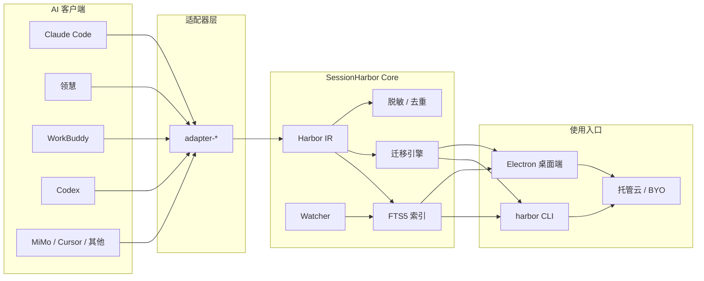

# SessionHarbor（会话港湾）

<p align="center">
  
</p>

<h1 align="center">SessionHarbor</h1>

<p align="center">
  <b>让散落在各个 AI 客户端里的对话，成为可检索、可迁移、可共享的资产。</b>
</p>

<p align="center">
  <a href="README.md">中文</a> ·
  <a href="README_EN.md">English</a> ·
  <a href="docs/项目开发文档.md">产品文档</a> ·
  <a href="docs/">设计文档</a> ·
  <a href="CONTRIBUTING.md">参与贡献</a>
</p>

<p align="center">
  
  
  
  
  
  
</p>

<p align="center">
  
</p>

---

## 为什么需要 SessionHarbor

多 AI 客户端并存已是常态：Claude Code、Codex、Cursor、MiMo Desktop、WorkBuddy、领慧……历史对话却各自为政。

| 痛点 | 现状 |
|---|---|
| **找不到** | 想不起「那句话在哪个客户端问过」，只能挨家翻找 |
| **带不走** | 换工具时对话无法迁移；官方通道往往单向、限时限量 |
| **存不下 / 不能共享** | 客户端卸载即丢；团队里「这个坑谁踩过」无法检索 |

SessionHarbor 提供本地优先的统一层：**发现 → 索引 → 检索 → 迁移 → 导出 → 同步**。

## 核心能力

| 能力 | 说明 |
|---|---|
| **多客户端聚合** | 自动发现本机 AI 客户端会话库，统一建索引 |
| **全文检索** | SQLite FTS5 + trigram，中文友好；1 万会话索引约 3.2s，搜索 < 40ms |
| **原生格式互迁** | 读源格式 → 中间表示（IR）→ 写目标私有格式，支持继续对话 |
| **导出** | Markdown / JSON / HTML |
| **增量监听** | 文件系统 watcher，会话变更自动刷新索引 |
| **安全写回** | 写前备份、事务回滚、进程占用检测、`--yes` 显式确认 |
| **脱敏与去重** | 密钥/token 扫描、重复/分叉会话检测 |
| **云同步（可选）** | BYO 目录 / WebDAV 免费；托管云支持登录与按用户隔离 |
| **桌面 GUI** | Electron：会话浏览、搜索、迁移向导、云推送/拉取 |

## 支持的客户端

| 客户端 | 读取 | 写入 / 迁入 | 备注 |
|---|:---:|:---:|---|
| Claude Code | ✅ | ✅ | JSONL 会话与 parentUuid 链 |
| 领慧 AI 工作台 | ✅ | ✅ | 信封事件流，与 CC 互转闭环 |
| WorkBuddy | ✅ | ✅ | 含工具/思考/产物保留 |
| Codex | ✅ | ✅ | rollout + SQLite 双索引回写 |
| MiMo Desktop | ✅ | ✅ | 本地 `mimocode.db` |
| Cursor | ✅ | ✅ | `~/.cursor/chats` |
| VS Code / Trae | ✅ | ✅ | 会话库适配 |
| Hermes / OpenClaw | ✅ | ✅ | 新增适配 |
| DeepSeek Harness | ✅ | — | 只读源 |
| Devin / TRAE SOLO | ✅ | ✅ | 桌面客户端库 |
| ChatGPT Export | ✅ | — | 官方 conversations.json 导入 |

> 具体能力以各 adapter 的 `capabilities` 为准。

## 架构一览



仓库为 **pnpm monorepo**：

```text
SessionHarbor/
├─ packages/core/            # IR、索引、迁移、脱敏、去重、watcher
├─ packages/adapters/*       # 各客户端适配器
├─ packages/cli/             # harbor 命令行
├─ packages/cloud-server/    # 托管云服务端（注册/登录/隔离存储）
├─ apps/desktop/             # Electron GUI
├─ docs/                     # ADR、设计稿、资产
├─ fixtures/                 # 脱敏样本
└─ scripts/                  # E2E、压测、打包
```

## 下载便携版

Windows 便携版 **不随源码仓库托管**（避免将大二进制塞进 git），请从 **[Releases](https://github.com/Delight0628/SessionHarbor/releases)** 下载 `SessionHarbor.exe`。

| 方式 | 说明 |
|---|---|
| Releases 页 | 稳定便携版 / CI 预览包 |
| 源码运行 | 见下方「快速开始」 |
| 自行打包 | `pnpm pack:exe`，产物在仓库根目录（已 gitignore） |

打 tag 推送或手动触发 Actions「Release」，会自动构建并上传 exe。

## 快速开始

### 环境要求

- **Node.js ≥ 22.5**（使用内置 `node:sqlite`，零原生编译）
- **pnpm** 10+（仓库锁定 `pnpm@11.x`）
- Windows / macOS / Linux

### 安装与构建

```bash
git clone https://github.com/Delight0628/SessionHarbor.git
cd SessionHarbor
pnpm install

# 编译核心与各包（或按需单独构建）
pnpm build
```

若 Electron 二进制下载失败（常见于内网/代理），可使用镜像：

```bash
# Windows PowerShell
$env:ELECTRON_MIRROR = "https://npmmirror.com/mirrors/electron/"
cd apps/desktop
node ../../node_modules/electron/install.js
```

### 启动桌面端

```bash
# 推荐
scripts/start-desktop.bat          # Windows
# 或
pnpm desktop
```

> 注意：必须从 **仓库根目录** 或 **apps/desktop** 启动；在 `apps` 目录下会报 `Unable to find Electron app`。

### 启动托管云（可选）

```bash
scripts/start-cloud.bat
# 默认 http://127.0.0.1:8787 ，数据目录 cloud-data/
```

```bash
node packages/cli/dist/bin.js register --email you@example.com --password <至少6位> --endpoint http://127.0.0.1:8787
node packages/cli/dist/bin.js login    --email you@example.com --password <密码>   --endpoint http://127.0.0.1:8787
node packages/cli/dist/bin.js whoami
```

### CLI 常用命令

```bash
# 入口
harbor="node packages/cli/dist/bin.js"

# 探测本机客户端与数据目录
$harbor info

# 列表 / 索引 / 搜索
$harbor list --client claude-code
$harbor scan --client alink
$harbor search 迁移 --limit 10

# 导出
$harbor export --client alink --id <sessionId> --format md --out out.md

# 迁移（写入必须 --yes；请先 --dry-run）
$harbor migrate --from alink --to claude-code --id <sessionId> --dry-run
$harbor migrate --from alink --to claude-code --id <sessionId> --yes

# 备份 / 监听 / 脱敏 / 去重
$harbor backup --client alink
$harbor watch --client claude-code
$harbor secrets
$harbor dedup
```

## 安全设计（写回）

1. **写前自动备份**目标数据库及 WAL/SHM 到 `.sessionharbor/backups/`
2. SQLite 写入使用 **事务**，失败即回滚
3. 目标会话已存在时默认跳过，需显式 `--overwrite`
4. CLI 写入必须 `--yes`（或先 `--dry-run`）
5. 默认剥离 user 消息中的 `<system-reminder>` 块
6. 目标客户端运行中时拒绝写入，避免锁冲突

## 商业模式（Obsidian 式）

| 层 | 价格 | 内容 |
|---|---|---|
| **本地层** | 永久免费 | 聚合、统一搜索、互迁、导出、分支 |
| **BYO 云** | 免费 | 自备网盘 / WebDAV，E2EE 推送 + 拉取 |
| **托管云 Free** | $0 | 50 会话 / 100MB |
| **托管云 Pro** | $5–8/月 | 1 万会话 / 20GB + Web 阅读 + 优先同步 |
| **托管云 Team** | 按席位 | 团队会话库 + 审计 + 企业 SSO |

本地核心能力永远免费；云端为可选增值。

## 文档

| 文档 | 说明 |
|---|---|
| [docs/项目开发文档.md](./docs/项目开发文档.md) | 产品定位、竞品、架构与里程碑（权威稿） |
| [docs/README.md](./docs/README.md) | 文档索引 |
| [docs/ADR-001-node-sqlite.md](./docs/ADR-001-node-sqlite.md) | 为何使用 `node:sqlite` |
| [docs/ADR-002-e2ee-sync.md](./docs/ADR-002-e2ee-sync.md) | 端到端加密同步设计 |
| [docs/team-library-schema.md](./docs/team-library-schema.md) | 团队会话库 Schema |
| [CONTRIBUTING.md](./CONTRIBUTING.md) | 贡献指南 |
| [SECURITY.md](./SECURITY.md) | 安全披露 |
| [CHANGELOG.md](./CHANGELOG.md) | 变更记录 |

## 开发与测试

```bash
# 单元测试（core）
pnpm unit

# 综合 E2E
pnpm e2e

# 1 万会话索引压测
pnpm bench

# 一键测试
pnpm test
```

打包 Windows 便携版：

```bash
pnpm pack:exe
```

## 路线图

- **M0** 领慧 ↔ Claude Code 双向互转 ✅
- **M1** 多客户端聚合 + FTS 搜索 + 迁移向导 ✅
- **M2** Electron GUI、watcher、脱敏/去重、打包分发 ✅（持续打磨）
- **M3** E2EE 云同步完善、团队库 🔜

欢迎在 [Issues](https://github.com/Delight0628/SessionHarbor/issues) 提需求与客户端适配请求。

## 参与贡献

欢迎 Issue / PR。开始前请阅读 [CONTRIBUTING.md](./CONTRIBUTING.md)。

新增客户端适配器时，请：

1. 在 `packages/adapters/<name>/` 实现统一 `Adapter` 接口
2. 补充脱敏 `fixtures` 样本
3. 更新本 README 支持矩阵与 `docs/项目开发文档.md`

## Star History

如果 SessionHarbor 帮到了你，欢迎点个 ⭐ Star，让更多人看到。

## 许可证

[MIT](./LICENSE) © 高国兴

---

<p align="center">
  <sub>Built with TypeScript · Electron · node:sqlite · Local-first</sub>
</p>
